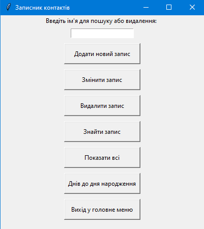
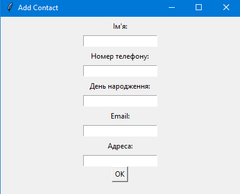

# PythonWizards
Group-12 team project "Personal_assistant"

Зміст:
1.Інструкція встановлення пакету\n
2.Інструкція користання записною книжкою
3.Інструкція користання мапою
4.Інструкція користання сортуванням
5.Гра

 

1.Інструкція встановлення:
Відкрити командну строку та перейти в дерикторію з застосунком, вписати комманди:
pip install -r requirements (встановлює всі нетсандартні бібліоткеи що були використані в коді)
pip install -e . (встановлює як пакет)
personal-assistant запускає

pip uninstall Personal_assistant (видаляє пакет)
pip uninstall -r requirements (видаляє нетсандартні бібліоткеи що були використані в коді)

------------------------------------------------------------------------------------------------------------------------------------------------------

2.Інструкція до застосунку "Записна книжка"

 

До записної книжки можна додавляти контакти, їх ім'я, номер, дату народження, емейл-адрессу та жилу адрессу.
Застосунок допомогає тримати всю цю інформацію в одному місці та при необхідності легко отримати те, що потребує користувач.
Застосунок автоматично зберігає усю інформацію на диск, запобігаючи видаленню інформації при помилці чи непередбачуванному замиканню застосунку.

Інструкція користання командами:
Додати контакт - поетапний ввід данних(імя, номер, день народження, Еmail, адресса).

 

Змінити контакт - поетапна зміна всього запису(Обовязково імя існуючого контакту, інше можна змінювати для поточного контакту)

 

Видалення контакту - команда "delete Name", де Name - це імя контакта.
Пошук контакту - команда "search Contact", де Contact - це імя контакта.
Показати всі контакти - команда "show_all"  - виводить список усіх контактів.

 

Дні народження - команда "birthday 7", де 7(може бути довільним) - це діапазон днів, в які може бути день народження записаного контакту.

------------------------------------------------------------------------------------------------------------------------------------------------------

4.Інструкція до застосунку "Мапа"
Застосунок створений для візуалізації та пошуку координат на картах. Основною 
функцією є виведення інтерактивної мапи з прапорцями раніше збережених 
координат.

 

Є три основних видів мап:
-Мапа ядерних об’єктів країни 404
-Мапа  аеропортів країни 404
-Мапа  адміністративних об’єктів країни 404
Також реалізоване збереження координат у відповідних файлах, за потреби 
користувач може отримати географічні координати за назвою міста.
Застосунок автоматично зберігає усю інформацію , запобігаючи видаленню інформації 
при помилці чи непередбачуваному замиканню застосунку.
Основні команди застосунку це: 'save_nuclear', 'add_nuclear', 'save_air', 'save_admin', 
'add_admin', 'coordinates', 'good bye', 'close', 'exit'.
Де: 
   'save_nuclear'             -Зберегти карту ядерних обєктів країни 404 
   'add_nuclear'              -Додати кординати до файлу з ядерними обєктами 
   'save_air'                 -Зберегти карту аеропортів країни 404 
   'add_air'                  -Додати кординати до файлу з аеропортами 
   'save_admin'               -Зберегти карту адміністративних обєктів країни 404 
   'add_admin'                -Додати кординати до файлу з ядерними обєктами 
   'coordinates'              -Отримати координати за назвою міста
   'good bye','close','exit ' -ихід.
 
Інструкція користання командами:
save – усі команди з таким префіксом зберігають карту з нанесеними мітками 
координат з відповідних текстових файлів у форматі html ( Наприклад: команда 
'save_nuclear'  збрігає карту з назвою 'russia_map_nuclear.html' з координатами, що 
вказані у файлі 'coordinates_nuclear.txt').
add – усі команди з префіксом «add» додають кординати у текстові відповідні текстові 
файли ( Наприклад: команда 'add_air'  додає до файлу 'coordinates_air.txt'  координати,
що вніс користувач).                     
сoordinates -  команда здійснює пошук координат по назві міста, за допомогою 
застосунку OpenCage Geocoder з використанням geocoding API key.           

------------------------------------------------------------------------------------------------------------------------------------------------------

5.Інструкція сортування:

 

Для сортування файлів по папкам, потрібно вказати шлях до папки, в форматі "С:/name/of/your/path" код автоматично перебере всі файли, та відсортує по папкам фото, відео, документи, музику, архіви та пайтон файли. Після сортування, в термінал будуть виведені всі відомі розширення що були знайдені в папці, та невідомі.

------------------------------------------------------------------------------------------------------------------------------------------------------

6.Інструкція до застосунку "Бандеро гусак у Моцкві"

 

Основною метою застосунку є -  розважальна. 
У грі є три основних об’єкти: гравець, бонуси та вороги. Гравець,  у нашому випадку 
це гусак, повинен зібрати якомога більше бонусів, при цьому ухилятись від ракет. Гра 
завершується, при потраплянні ракети у гусака.
Керування гусаком відбувається за допомогою клавіш навігації зі стрілками.
